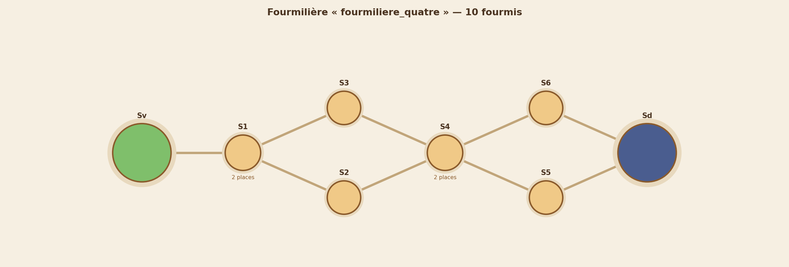
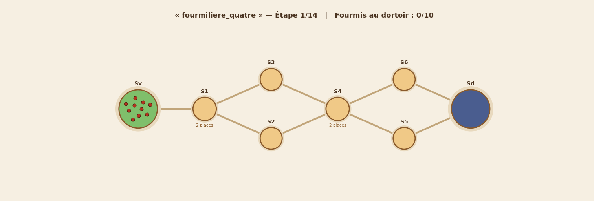

# 🐜 Une vie de fourmi

> *What do you call a 100 year old ant? An antique!*

Projet d'algorithmique en **Python** — La Plateforme.
Comment déplacer toute une colonie de fourmis, du vestibule jusqu'au dortoir,
en un **minimum d'étapes** ?

**Auteurs : Rooney & Yanis**

---

## 1. La problématique

Une colonie de `F` fourmis a construit sa fourmilière sous terre : un
assemblage de **salles** reliées par des **tunnels**. À la tombée de la nuit,
toutes les fourmis se retrouvent dans le **vestibule** (`Sv`), près de la
surface, un endroit dangereux. Elles doivent toutes rejoindre le **dortoir**
(`Sd`), tout au fond, le plus vite possible.

Les règles du déplacement :

- à chaque **étape**, une fourmi attend sur place ou passe dans une salle
  adjacente (les tunnels sont traversés instantanément, comme des portes) ;
- une salle ordinaire n'accueille qu'**une seule fourmi** à la fois — sauf
  indication contraire : une salle notée `S3 { 4 }` peut en accueillir 4 ;
- le vestibule et le dortoir ont une capacité **illimitée** ;
- une fourmi ne peut entrer dans une salle que si celle-ci a de la place,
  ou si la fourmi qui l'occupe est **en train de partir** ;
- un tunnel ne laisse passer qu'**une fourmi par étape** ;
- l'intégralité des fourmis doit rejoindre le dortoir en un
  **minimum d'étapes**.

## 2. 🌱 La fourmilière expliquée à tous (vulgarisation)

> À la tombée de la nuit, toutes les fourmis sont réunies dans le hall
> d'entrée de la fourmilière, et chacune doit regagner le dortoir, tout au
> fond. Le problème : les salles intermédiaires sont minuscules — souvent une
> seule place — et chaque tunnel ne laisse passer qu'une fourmi à la fois. Si
> toutes se ruaient dans le couloir le plus court, elles formeraient un
> embouteillage, comme des voyageurs qui s'entassent devant un seul escalator
> alors que la gare en compte trois. La colonie fait donc preuve
> d'intelligence collective : elle répartit ses ouvrières entre **tous** les
> chemins disponibles, quitte à en envoyer certaines par un détour, et chaque
> fourmi avance dès qu'une place se libère devant elle, sans jamais patienter
> inutilement. Le résultat est un ballet parfaitement synchronisé où, à
> chaque instant, le plus grand nombre possible de fourmis progresse — et où
> la dernière rejoint son lit le plus tôt qu'il est mathématiquement
> possible de le faire.

## 3. La modélisation : un graphe

La fourmilière est naturellement un **graphe** :

| Fourmilière | Graphe |
|---|---|
| une salle | un sommet |
| un tunnel | une arête |
| capacité d'une salle | capacité d'un sommet |
| « une fourmi par tunnel et par étape » | capacité d'arête = 1 |

Le graphe est construit et manipulé avec **NetworkX**, et dessiné avec
**Matplotlib** (voir `resultats/graphes/`).

## 4. La solution : un graphe « déplié dans le temps » + flot maximum

L'idée qui résout tout : **ajouter le temps au graphe**.

1. Chaque salle est **dupliquée** pour chaque instant `t = 0, 1, …, T` :
   le sommet `(S1, t)` signifie « être dans la salle S1 à l'instant t ».
2. Se déplacer devient un arc `(S1, t) → (S2, t+1)` ; attendre devient un
   arc `(S1, t) → (S1, t+1)`.
3. Les capacités des salles et des tunnels deviennent des **capacités
   d'arcs** : une salle de 3 places ne laisse « passer » que 3 fourmis par
   instant, un tunnel n'en laisse passer qu'une.
4. Faire arriver `F` fourmis au dortoir en `T` étapes revient alors à faire
   passer un **flot** de valeur `F` de `(Sv, 0)` vers le dortoir — un
   problème classique de **flot maximum**, résolu par NetworkX.
5. On cherche le **plus petit `T`** pour lequel le flot atteint `F` : en
   partant de la borne basse (le plus court chemin `Sv → Sd`) et en
   augmentant `T` de 1 en 1, le premier `T` qui réussit est, par
   construction, **le minimum d'étapes** — la solution est **optimale**,
   pas seulement « bonne ».

Enfin, le flot (des quantités anonymes) est traduit en déplacements de
fourmis **individuelles** (`f1 - Sv - S1`), et une fonction `verifier()`
recontrôle chaque règle du brief, étape par étape, par sécurité.

## 5. Structure du dépôt

```
uneviedefourmi/
├── ants.py             # les classes (Salle, Fourmi, Fourmiliere) + le solveur
├── main.py             # la résolution de toutes les fourmilières
├── visualisation.py    # graphes PNG + animations GIF
├── fourmilieres/       # les 9 fourmilières du brief (.txt)
├── resultats/
│   ├── etapes/         # les étapes de chaque solution (.txt)
│   ├── graphes/        # chaque fourmilière en graphe (.png)
│   └── animations/     # le déplacement animé, étape par étape (.gif)
├── requirements.txt
└── README.md
```

## 6. Installation et utilisation

```bash
pip install -r requirements.txt

python main.py                                     # tout résoudre
python main.py --fichier fourmilieres/fourmiliere_un.txt   # une seule
python main.py --sans-animation                    # plus rapide (sans GIF)
```

Le programme affiche les étapes au format du brief :

```
+++ E1 +++
f1 - Sv - S1
f2 - Sv - S2
+++ E2 +++
f1 - S1 - Sd
...
```

## 7. Résultats

| Fourmilière | Fourmis | Salles | Étapes (minimum) |
|---|---:|---:|---:|
| fourmiliere_zero | 2 | 4 | **2** |
| fourmiliere_un | 5 | 4 | **7** |
| fourmiliere_deux | 5 | 4 | **4** |
| fourmiliere_trois | 5 | 6 | **7** |
| fourmiliere_quatre | 10 | 8 | **14** |
| fourmiliere_cinq | 50 | 16 | **54** |
| fourmiliere_3D | 50 | 11 | **29** |
| salle_d_at-ant | 100 | 23 | **30** |
| La_hormiguera_de_la_muerte | 30 | 12 | **33** |

Quelques observations qui confirment l'optimalité :

- `fourmiliere_deux` possède un tunnel **direct** `Sd - Sv` : le solveur
  l'exploite (une fourmi par étape) en plus du couloir, d'où 4 étapes
  seulement au lieu de 7 ;
- `salle_d_at-ant` : 100 fourmis réparties équitablement sur les
  4 couloirs (25 chacun) → 25 + 5 déplacements = **30 étapes**, exactement
  la borne théorique ;
- `La_hormiguera_de_la_muerte` : tout le monde doit franchir l'unique
  tunnel `S10 - Sd` (1 fourmi/étape). Première arrivée possible à l'étape 4,
  puis une fourmi par étape → 4 + 29 = **33 étapes**, la borne exacte.

## 8. Aperçu





## 9. Conclusion

Ce projet montre qu'un problème très concret — des fourmis pressées d'aller
se coucher — se transforme, avec la bonne modélisation, en un problème
classique de théorie des graphes. Le passage par un **graphe temporel** rend
comptables à la fois les capacités des salles, celles des tunnels et le
temps qui passe ; le **flot maximum** garantit alors une solution
**mathématiquement minimale**, vérifiée règle par règle. Les visualisations
(graphes et animations) rendent enfin le résultat lisible par tous :
on *voit* la colonie se répartir intelligemment entre les chemins,
exactement comme le décrit notre paragraphe de vulgarisation.

## 10. Ressources

- [Adjacency matrix — Graph Theory Tutorial](https://people.revoledu.com/kardi/tutorial/GraphTheory/Adjacency-Matrix.html)
- [NetworkX Tutorial](https://networkx.org/documentation/stable/tutorial.html)
- Maximum flow : L. R. Ford & D. R. Fulkerson, *Flows in Networks* (1962)
